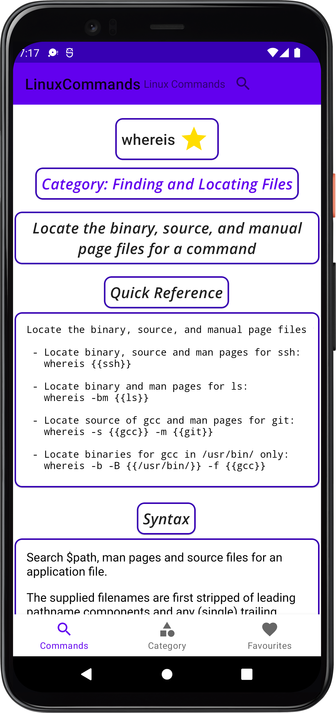

Linux Commands - CheatSheet

## Features
- Easily Search any linux Command. 
- View Usage and implementation of the Command

## Technology Used
- Kotlin
- Fragment
- Navigation Components
- Safe Args
- RecyclerView
- ROOM DB

## ScreenShots

| | | |
|:----:|:----:|:----:|
|  |  |  |

| | | |
|:----:|:----:|:----:|
| |  |  |
